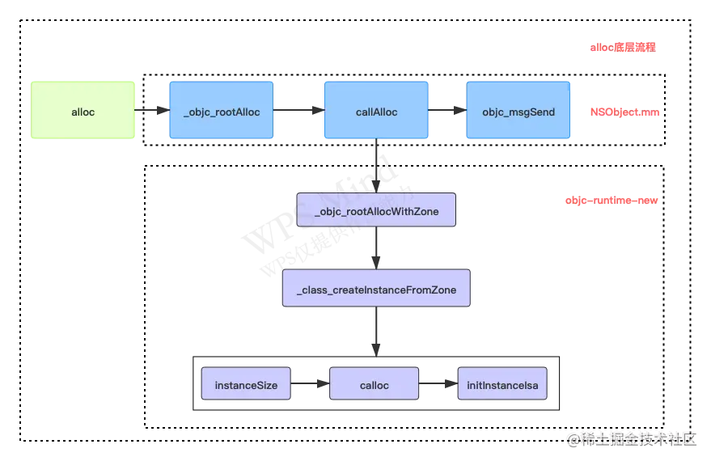

# objc\_基础

## 1、属性关键字

属性（property）用于封装对象中的数据。令编译器自动生成属性相关的存取方法，并且保存为各种实例变量。

属性本质是实例变量与存取方法的结合。`@property = ivar + getter + setter`

**属性关键字类型：**

* 原子性：`automic(默认)`、`nonatomic`
* 读写权限：`readonly`、`readwrite(默认)`
* 内存管理：`assign`、`retain`、`strong(默认)`、`copy`、`weak`、`unsafe_unretained`
* 方法名：`getter`、`setter`

> atomic原子性，编译器会自动生成互斥锁，保证属性赋值和取值安全，不包括操作和访问
>
> assign修饰基本数据类型、weak指向但不拥有该对象，不增加引用计数、unsafe\_unretained销毁时不自动清空，容易形成野指针

* **synthesize**：编译时自动生成 setter、getter方法和\_ivar实例变量，可指定实例变量名字
* **dynamic**：getter、setter在运行时产生

## 2、NSDictiony实现

NSDictionary（字典）是使用 hash表来实现key和value之间的映射和存储的。

NSDictionary使用NSMapTable实现，NSMapTable同样是一个key－value的容器。

```objectivec
typedef struct {
   NSMapTable        *table;   //table对象自身的指针
   NSInteger          i;       //计数值
   struct _NSMapNode *j;       //节点指针
} NSMapEnumerator;
```

NSMapTable是一个**哈希**＋链表的数据结构，在NSMapTable中插入或者删除一对对象时， 寻找的时间是O(1)＋O(m)，m最坏时可能为n。

NSMapTable使用**NSObject的哈希函数**：

```objectivec
-(NSUInteger)hash {
   return (NSUInteger)self>>4;
}
```

NSDictionary 提供了 key -> object 的映射。存储object的位置由key值来索引，hash值是NSObject的哈希函数，因此NSDictionary 会始终copy key 到自己私有空间。而且object对象在内部是强引用。

key 的copy行为也是 NSDictionary 如何工作的基础，这就限制了只能使用OC对象作为NSDictionary的key，并且必须支持NSCopying协议。

## 3、NSNotification实现

通知是iOS对观察者模式的实现，通知通过NSNotificatinonCenter单例来管理及通知观察者。

NSNotificatinonCenter介绍：

> * `NSNotificatinonCenter`是使用观察者模式来实现的用于跨层传递消息，用来降低耦合度。
> * `NSNotificatinonCenter`用来管理通知，将观察者注册到`NSNotificatinonCenter`的通知调度表中，然后发送通知时利用标识符`name`和`object`识别出调度表中的观察者，然后调用相应的观察者的方法，即传递消息。如果是基于`block`创建的通知就调用`NSNotification`的`block。`

**NSNotification介绍：**

> `NSNotification`是方便`NSNotificationCenter`广播到其他对象时的封装对象，简单讲即通知中心对通知调度表中的对象广播时发送`NSNotification`对象。

通知中心广播发送通知是通过`name`和`object`来确定来标识观察者，NSNotificatinonCenter调度表根据`name`和`object`来设计。定义了两个Table，一张用于保存添加观察者的时候传入了NotifcationName的情况。一张用于保存添加观察者的时候没有传入了NotifcationName的情况。

<figure><figcaption><p>NSNotification <strong>Named Table</strong></p></figcaption></figure>

<figure><figcaption><p>NSNotification <strong>Namless Table</strong></p></figcaption></figure>

**wildcard**\
wildcard是链表的数据结构，如果在注册观察者时既没有传入NotificationName，也没有传入object，就会添加到wildcard的链表中。注册到这里的观察者能接收到 所有的系统通知。

**NSNotificationQueue**是notification Center的缓冲池，遵循FIFO的顺序转发通知给`NSNotificationCenter。`每个线程都有一个默认的NSNotificationQueue。

## 4、NSMutableArray实现


## 问题

#### 1、什么是哈希表？什么是哈希冲突？

哈希表，又称散列表，通过建立键`key`与值`value`之间的映射，实现高效的元素查询。**在哈希表中进行增删查改的时间复杂度都是 O(1)。**

哈希冲突指哈希函数多个输入对应了相同输出的情况。

哈希冲突原因：哈希函数是否均匀、哈希冲突处理的方法、哈希表的负载因子`(负载因子 = 填入表中的元素个数 / 哈希表的长度)`


#### 2、通知的发送时同步的，还是异步的？

通知的发送是同步的，发送和接收通知在同一个线程。

#### 3、页面销毁时不移除通知会崩溃吗？多次添加同一通知会是什么结果？多次移除通知呢？

iOS 9后，系统使用weak指针修饰observe，当observe被释放后，再次发送消息给nil不会引起崩溃，系统会下次发送通知时移除observe为nil的观察者。

多次添加同一通知，回调会触发多次。(因为添加通知时没有做重复过滤，通过key值查到对应的链表后添加到末尾，因此会触发多次)

多次移除，无影响。现在map中查找，然后做删除。


